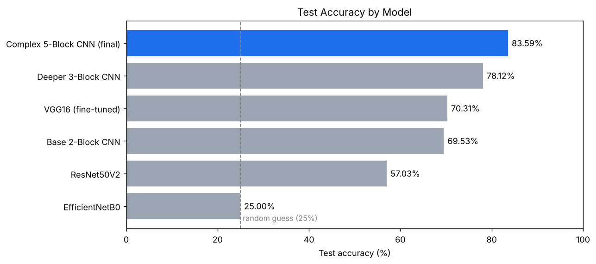
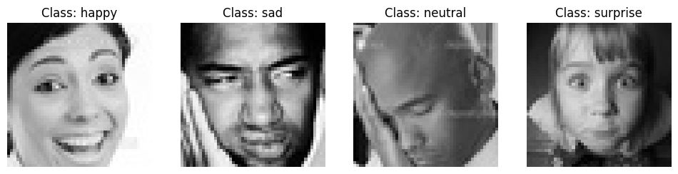
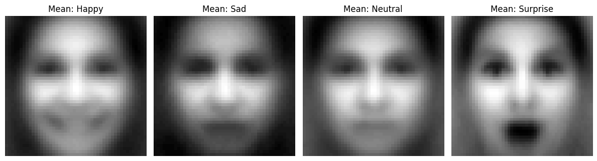
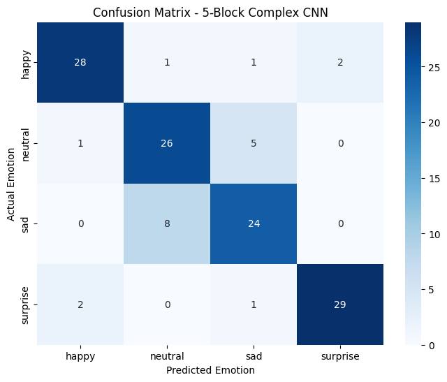
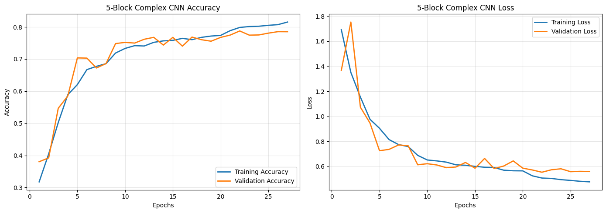

# Facial Emotion Detection with Deep Learning

Capstone project for the **MIT Applied AI & Data Science Program**: classifying 48×48 grayscale face images into four emotions (**happy, neutral, sad, surprise**) and comparing custom CNNs against ImageNet transfer-learning models.

**Best model:** a 5-block grayscale CNN trained from scratch. It reached **83.59% test accuracy** and beat VGG16, ResNet50V2 and EfficientNetB0.



---

## Problem

Facial expressions carry useful signals for customer service, healthcare, education and human-computer interaction. The aim was to build a model that classifies a face image into one of four emotions and to answer:

- Can emotions be classified reliably from low-resolution images?
- Do custom CNNs beat transfer learning on this data?
- Does grayscale input work better than RGB?
- Which model balances accuracy, generalisation and per-class performance best?

## Dataset

| Split | Happy | Neutral | Sad | Surprise | Total |
| --- | ---: | ---: | ---: | ---: | ---: |
| Train | 3,976 | 3,978 | 3,982 | 3,173 | 15,109 |
| Validation | 1,825 | 1,216 | 1,139 | 797 | 4,977 |
| Test | 32 | 32 | 32 | 32 | 128 |

All images are 48×48 grayscale. *Surprise* is the smallest training class, about 20% smaller than the others, so the imbalance is mild.

> The dataset was provided through the program and is **not included** in this repository. See [`data/README.md`](data/README.md).

<p align="center">
  <br>
  
</p>

## Approach

1. **EDA:** checked class balance and image dimensions, plotted the pixel-intensity histogram, and computed the mean face for each emotion.
2. **Data pipeline:** Keras `ImageDataGenerator` rescales pixels to 0–1. Training images also get augmentation (±15° rotation, 10% shifts and zoom, horizontal flips).
3. **Models:** all were trained with Adam, categorical cross-entropy, `EarlyStopping` (patience 5) and `ReduceLROnPlateau`.

| # | Model | Input | Params | Notes |
| --- | --- | --- | ---: | --- |
| 1 | Base 2-Block CNN | Grayscale | 1.2M | Conv(32) → Conv(64), Dense(128) |
| 2 | Deeper 3-Block CNN | Grayscale | 2.7M | Conv(64/128/256), Dense(256) |
| 3 | VGG16 | RGB | 14.9M | ImageNet weights; block 5 fine-tuned, LR 1e-5, L2 head |
| 4 | ResNet50V2 | RGB | 24.1M | ImageNet weights; frozen base |
| 5 | EfficientNetB0 | RGB | 4.4M | ImageNet weights; frozen base |
| 6 | **Complex 5-Block CNN** | **Grayscale** | **9.7M** | Two 3×3 convs per block (64→128→256→512→512), BatchNorm, Dropout, Dense(512) |

## Results

| Model | Test accuracy | F1 Happy | F1 Neutral | F1 Sad | F1 Surprise |
| --- | ---: | ---: | ---: | ---: | ---: |
| EfficientNetB0 | 25.00% | 0.40 | 0.00 | 0.00 | 0.00 |
| ResNet50V2 | 57.03% | 0.64 | 0.39 | 0.45 | 0.77 |
| Base 2-Block CNN | 69.53% | 0.70 | 0.66 | 0.54 | 0.89 |
| VGG16 | 70.31% | 0.78 | 0.58 | 0.60 | 0.84 |
| Deeper 3-Block CNN | 78.12% | 0.91 | 0.68 | 0.62 | 0.91 |
| **Complex 5-Block CNN** | **83.59%** | **0.89** | **0.78** | **0.76** | **0.92** |

<p align="center">
  
  
</p>

### Key takeaways

- **Grayscale CNNs built for this data beat transfer learning.** Converting 1-channel images to RGB only copies the same values into three channels, and ImageNet filters are tuned for larger, colour images.
- **Deep pre-trained networks lose detail at 48×48.** ResNet50V2 and EfficientNetB0 downsample the input to a tiny feature map. VGG16 is the shallowest of the three and did best among them.
- **Sad vs. neutral is the hardest boundary.** The final model raised Sad F1 from 0.54 (baseline) to 0.76. Most of its remaining errors are sad and neutral faces mistaken for each other (see the confusion matrix).
- **EfficientNetB0 collapsed and predicted "happy" for every image.** One likely cause is that Keras' EfficientNet already rescales its input internally, so dividing by 255 beforehand left it with near-black images.

### Limitations

- The test set has only 128 images, so each image is worth about 0.8 percentage points of accuracy.
- Each model was trained once (no averaging across seeds), so re-running will give somewhat different numbers.
- The pre-trained models were fed 0–1 inputs instead of their own `preprocess_input`, which may have understated their performance.

## Repository structure

```
.
├── notebooks/
│   └── Facial_Emotion_Detection.ipynb   # full, commented notebook with original outputs
├── reports/
│   ├── Final_Presentation.pdf           # capstone presentation
│   └── Final_Submission.html            # HTML export of the submitted notebook
├── images/                              # figures used in this README
├── data/
│   └── README.md                        # where to put the dataset
├── requirements.txt
└── README.md
```

## How to run

**Google Colab (recommended, GPU):** open the notebook in Colab, upload `Facial_emotion_images.zip` to Google Drive and set `ZIP_PATH` in the first code cell. Then choose *Runtime → Run all*.

**Locally:**

```bash
git clone <this-repo-url>
cd Facial-Emotion-Detection
python -m venv .venv && source .venv/bin/activate
pip install -r requirements.txt
# put Facial_emotion_images.zip in data/
jupyter notebook notebooks/Facial_Emotion_Detection.ipynb
```

Training all six models takes under an hour on a Colab GPU. On CPU it takes considerably longer.

## Next steps

- Use each pre-trained model's own `preprocess_input` and retrain EfficientNetB0 on raw 0–255 pixels.
- Crop to facial landmarks (OpenCV/MediaPipe) before classifying.
- Export the final model to TensorFlow Lite with post-training quantisation for edge devices.
- Build a real-time webcam demo: face detection → 48×48 grayscale → CNN.
- Evaluate on a larger test set and check fairness across demographic groups.

## Tech stack

Python · TensorFlow / Keras · scikit-learn · NumPy · pandas · Matplotlib · Seaborn · Google Colab

---

*Sauraj Karki, MIT Applied AI & Data Science Program*
